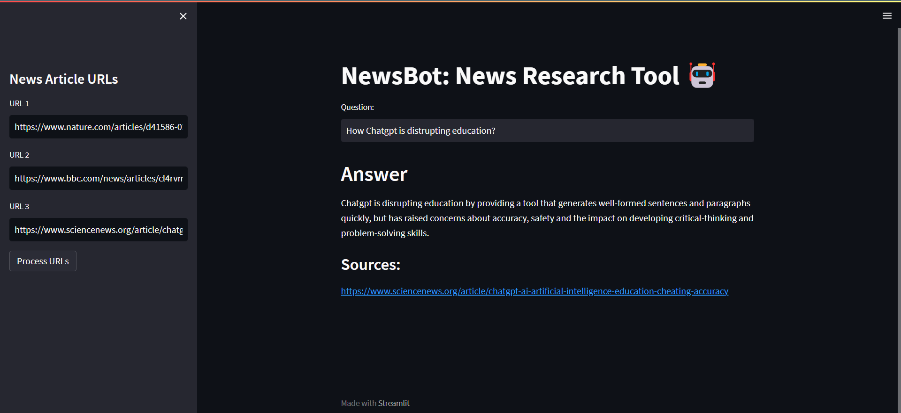

# NewsChatBot🤖

NewsChatBot is a powerful and versatile chatbot that can help you extract valuable insights from news articles. Whether you want to stay informed about current events or conduct research, NewsChatBot has you covered. With its user-friendly interface and state-of-the-art natural language processing capabilities, this chatbot is your go-to tool for news analysis.


## Introduction

NewsChatBot is designed to streamline the process of analyzing news articles, making it easier for you to extract key information and answer specific questions. Here are some of the use cases of NewsChatBot:

1. **Data Loading from News URLs**: Quickly load data from news articles by pasting their URLs. The chatbot's sophisticated web scraping capabilities ensure that you get the most relevant content.

2. **Text Splitting**: To facilitate efficient analysis, NewsChatBot divides the news articles into manageable chunks, allowing you to focus on specific sections.

3. **Word Embeddings**: The chatbot converts words in the news articles into vectors (embeddings) and stores them in a fast database for easy access and retrieval.

4. **Question-Answering**: Ask questions about the news articles, and NewsChatBot will provide accurate and concise answers based on its understanding of the content.


## Getting Started

### Installation

To get started with NewsChatBot, simply clone this repository and install the required dependencies listed in the `requirements.txt` file. You can use the following command to install the dependencies:

```bash
pip install -r requirements.txt
```

### Usage

1. Load news data by pasting the URLs of news articles.

2. Let NewsChatBot split the text and generate word embeddings for efficient analysis.

3. Start asking questions related to the news articles.


### Example Usage

Here are some examples of how you can use NewsChatBot to analyze news articles:

- Ask a question about a specific news article: 
- Obtain answers for specific news articles: 
- Get insights from different news articles: 
- Conduct comparative analysis: 

## Contribution

 If you have ideas for improvements or bug fixes, please feel free to open an issue or submit a pull request. 

## License

This project is licensed under the MIT License - see the [LICENSE](LICENSE) file for details.
